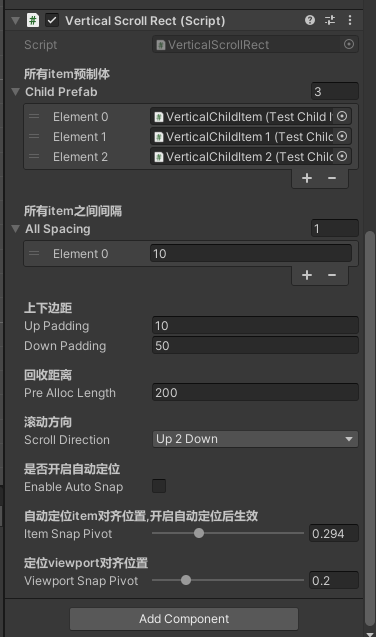

之前一直使用的是SuperScrollView组件,直到遇到了一个需求:单个item的长度超过了一个屏幕高度(大约6000像素-8000像素)的一个竖直滚动条,同时需要支持代码滚动到指定位置和快速定位到指定位置,但是SuperScrollView提供的相应函数都需要开启snap,在实验了诸如[EnhancedScrollView](https://github.com/tinyantstudio/EnhancedScrollView)\\[FancyScrollView](https://github.com/setchi/FancyScrollView)等组件后,发现都不支持长item在不开启snap的情况下代码滚动到指定位置及快速定位等功能,因此决定自行实现一个滚动条以满足需求.
也许已经有其他组件已经实现了此功能,也许是我使用过的某个滚动条组件是支持这个需求的,如果有这些情况,还希望留言告知...
*这是一个在Unity的UGUI中使用的滚动条组件*
# 功能概述
1. 支持一个列表中同时存在多种item类型,通过委托将数据下标和使用的item下标对应
2. 支持一个列表中同时存在多种item间隔,通过委托将数据下标和使用的item下标对应
3. 支持snap
4. 支持jump到指定数据显示位置,可以指定小数(如jump到3.5位置代表jump到数据下标为3的item的中间位置)
5. 支持指定时间或指定速度的方式自动滚动到指定数据显示位置(同样可以指定小数)
# 使用说明
## 非无限竖直滚动条
组件在Inspector窗口中的配置内容如下图:

   
### 开始滚动的函数
```
        /// <summary>
        /// 开始滚动条
        /// </summary>
        /// <param name="itemCount">item数量</param>
        /// <param name="refreshItemAction">刷新item执行</param>
        /// <param name="recycleItemAction">当item回收时执行</param>
        /// <param name="getchildItemPrefabIndex">根据数据下标获取子对象预制体下标</param>
        /// <param name="getChildItemPaddingIndex">根据数据下标获取子对象间隔下标</param>
        /// <param name="getItemHeight">获取item高度</param>
        /// <param name="onScrollRectValueChangeItemAction">当滚动条滚动时每个item上执行函数</param>
        /// <param name="onScrollRectValueChangeAction">当滚动条滚动时执行函数</param>
        /// <param name="initItemPos">初始化显示下标</param>
        public void StartScrollView(
            int itemCount,
            Action<ScrollRectViewItem> refreshItemAction,
            Action<ScrollRectViewItem> recycleItemAction,
            Func<int, int> getchildItemPrefabIndex = null,
            Func<int, int> getChildItemPaddingIndex = null,
            Func<int, float> getItemHeight = null,
            Action<ScrollRectViewItem, float> onScrollRectValueChangeItemAction = null,
            Action<float> onScrollRectValueChangeAction = null,
            float initItemPos = 0)
```
### 使用以下函数跳跃到指定位置
```
        /// <summary>
        /// 瞬间跳跃到指定位置
        /// </summary>
        /// <param name="position">从 0-元素个数 取值</param>
        /// <param name="autoSnap">跳跃完成后是否自动定位</param>
        public void JumpTo(float position, bool autoSnap = false)
```
### 使用以下函数自动滚动到指定位置
```
        /// <summary>
        /// 指定速度滚动到指定位置
        /// </summary>
        /// <param name="targetPos">滚动的下标位置</param>
        /// <param name="speed"></param>
        /// <param name="blockRaycasts">是否屏蔽点击</param>
        /// <param name="onScrollEnd">当滚动完毕回调</param>
        /// <param name="autoSnap">滚动完毕后是否自动定位</param>
        public void ScrollToBySpeed(float targetPos, float speed, bool blockRaycasts = true, Action onScrollEnd = null, bool autoSnap = false)
```
```
        /// <summary>
        /// 指定时间滚动到指定位置
        /// </summary>
        /// <param name="targetPos"></param>
        /// <param name="time"></param>
        /// <param name="blockRaycasts">是否屏蔽射线检测</param>
        /// <param name="onScrollEnd">当滚动完毕回调</param>
        /// <param name="autoSnap">滚动完毕后是否自动定位</param>
        public void ScrollToByTime(float targetPos, float time, bool blockRaycasts = false, Action onScrollEnd = null, bool autoSnap = false)
```
### 使用案例请查看场景 VerticalScroll
## 其他竖直无限滚动条\水平滚动条\格子滚动条等等待后续开发
